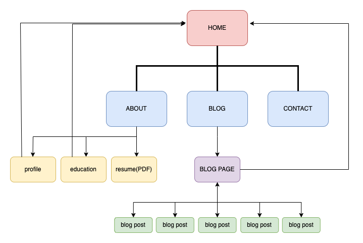

# Yuka's portfolio Website 

## Purpose

To demonstrate my skills as a developer. 

## Target audience

- People who are looking for a web developer.

## Functionality / features

- Website top page

⋅⋅* The website top page has 3 section; ABOUT / BLOG / CONTACT 

⋅⋅* In the head of the page, it has a navigation bar to navigate each section easily.

⋅⋅* In the bottom of the page, it has links to GitHub and LinkedIn, and arrow button to navigate to the top of the page.

- ABOUT section

⋅⋅* ABOUT section has a 3 links which navigate to profile page, education page and sesume PDF file.

⋅⋅* Profile page and education page each have a link back to the website top page.

- BLOG section

⋅⋅* Blog section has a link to blog main page.

⋅⋅* Blog main page has 5 links of blog posts. Also, it has a link back to the website top page.

⋅⋅* The blog post pages have a link back to blog main page.

## Sitemap

Here's the sitemap of my website:

## Wireframe

Here's the wireframe of my website:
[Wireframe](./docs/Portfolio%20-%20wireframe.pdf)

## Screenshots of my website

Here's the screenshots of my website:
[image of my website top page](./docs/Screenshots%20of%20my%20website.pdf)

## Tech stack

- HTML(Hypertext Markup Language)
- CSS(Cascading Style Sheets)

## Links 

[My website link](https://admiring-wozniak-731ae3.netlify.app) 

[My GitHub repository link]()
